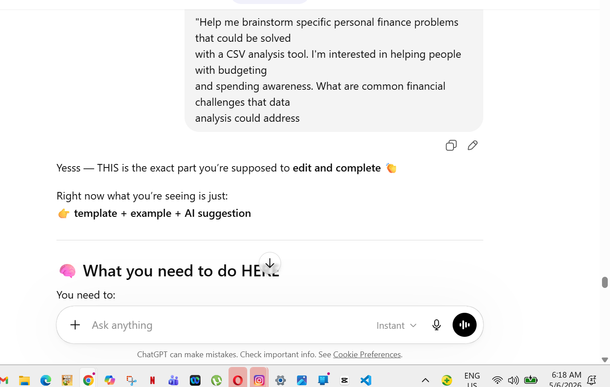
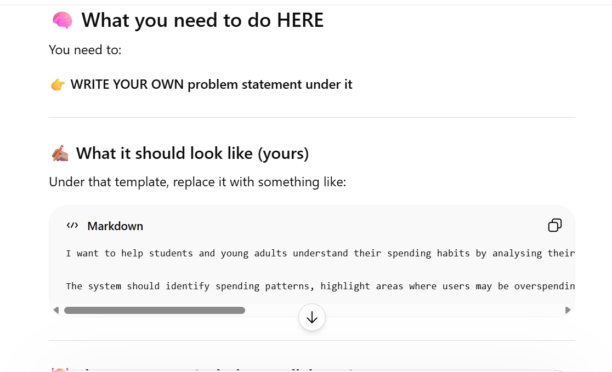
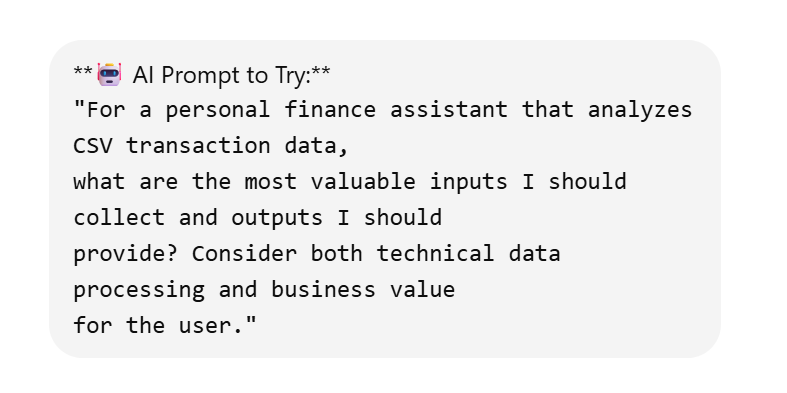
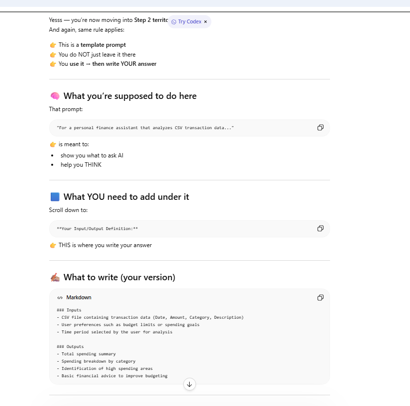

### Entry 1 – Brainstorming Finance Problem

**Artifact:**

**Context:**
I was trying to get AI chat to help me come up with a problem to solve for my Smart Finance Assistant.

**My Prompt:**
"Help me brainstorm specific personal finance problems that could be solved with a CSV analysis tool."

**AI Response Summary:**
The AI gave ideas related to students and young adults, including budgeting, saving, and tracking their spending.

**My Critique/Improvement:**
Some of the ideas were too general, so I decided to focus specifically on students and young adults. The AI also gave too many ideas, so I narrowed it down to spending habits.

**Reflection:**
I learned that AI can generate many ideas quickly, but I need to choose and refine the one that is most relevant to my project.

### Entry 2- Defining Inputs and Outputs

**Artifact:**
**Artifact:**

**Context:**
I was trying to get AI chat to help me come up with a problem to solve for my Smart Finance Assistant.

**My Prompt:**
"For a personal finance assistant that analyzes CVS trsnsaction data ,what are the most valuable inputs and outputs i could use."

**AI Response Summary:**
The AI suggested inputs such as transaction data, user preferences, and time periods. It also suggested outputs like spending summaries, category breakdowns, and financial advice.

**My Critique/Improvement:**
Some of the suggestions that the AI gave were not narrow ,they were broad ,so i picked the ones that were relevant and focused more on the relevant data for the system like user preferences

**Reflection:**
I learned that AI can help ideas of generating ,and that collecting data like inputs and outputs help with the structuring of the system before the coding part and the AI will help with the process

### Entry 3- Defining Inputs and Outputs

**Artifact:**

**Context:**
I used AI chat to help generate realistic Australian transaction data examples for my Smart Finance Assistant project. The goal was to practice manual financial calculations and identify spending insights from transaction data.

**My Prompt:**
"Give me 3 realistic examples of Australian transaction data with different scenarios (normal spending, refunds, large purchases). Show me how to manually calculate meaningful financial insights from each scenario."

**AI Response Summary:**
The AI generated transaction examples involving groceries, refunds, shopping expenses, and large purchases such as a laptop. It also calculated total spending, category spending, averages, and financial insights for each example.

**My Critique/Improvement:**
Although the calculations were correct, some transaction values seemed unrealistic for a university student budget, especially large spending amounts and expensive purchases. I adjusted some of the values to better reflect realistic student spending habits and everyday expenses.

**Reflection:**
 learned that AI-generated examples may still need adjustment depending on the target audience and project context. Even when calculations are correct, the data should still make sense for the intended users of the system.
 

